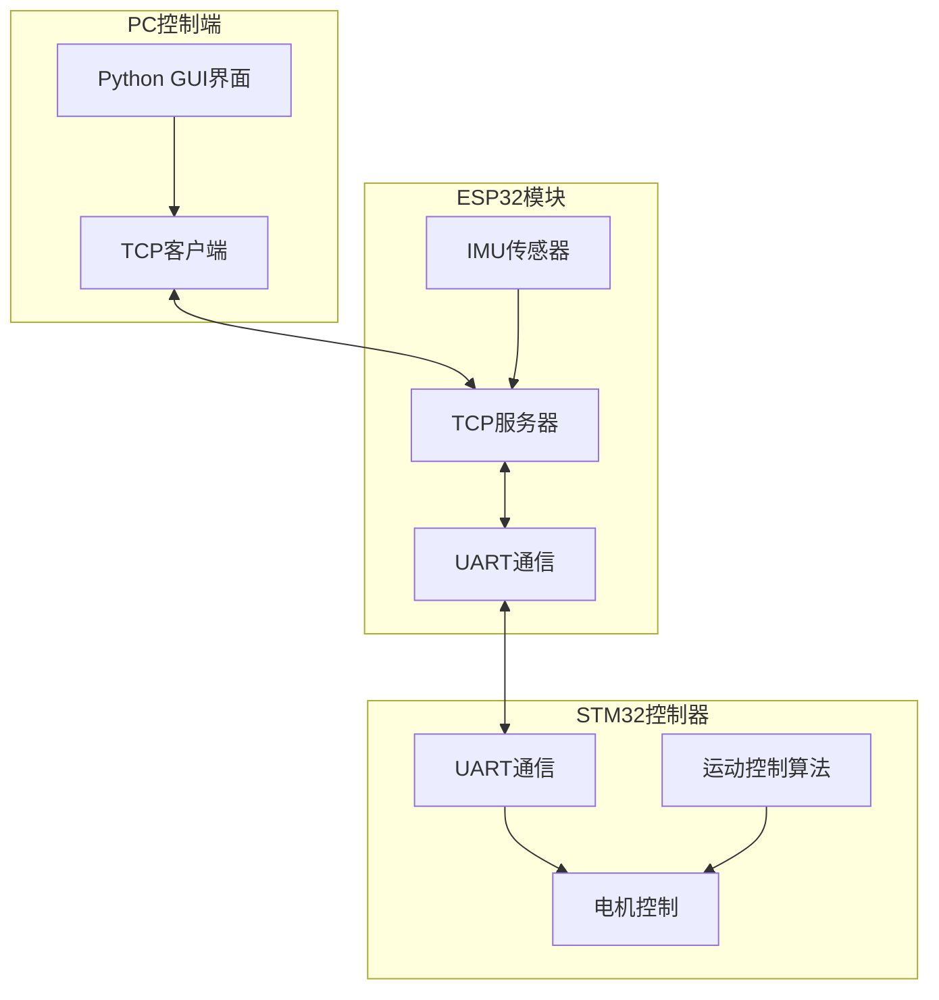
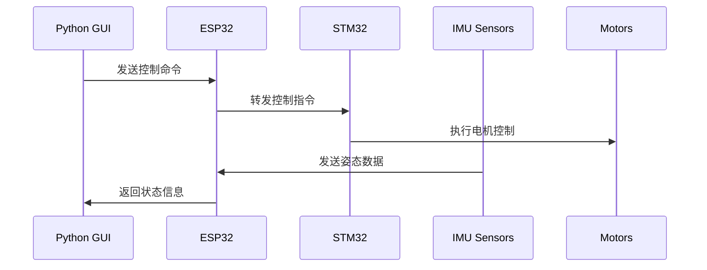

# BSRL-SerpentiFlex-Dual-Mode-Robot

这是一个基于ESP32和STM32的双模态蛇形机器人系统，支持蠕虫步态和蛇形运动模式。系统包含多个IMU传感器用于姿态检测，通过TCP/IP进行数据传输和控制。

## 系统架构

## 数据流

## 主要功能

1. 双模态运动控制
   - 蠕虫步态模式
   - 蛇形运动模式
   - 实时切换运动模式

2. 传感器系统
   - 多IMU姿态检测
   - 实时数据采集和显示
   - 传感器数据可视化

3. 用户界面
   - 直观的GUI控制界面
   - 实时状态显示
   - 运动参数调节
   - 紧急停止功能

## 通信协议

### TCP/IP通信
- 端口：8080
- 数据格式：JSON
- 主要命令：
  - START: 启动系统
  - STOP: 停止运动
  - MODE_SWITCH: 切换运动模式
  - SET_PARAMS: 设置运动参数

### UART通信
- 波特率：115200
- 数据格式：自定义协议
- 通信内容：控制命令和传感器数据

## 使用说明

1. 系统启动
   - 确保ESP32和STM32正确连接
   - 运行GUI程序
   - 连接TCP服务器
   - 初始化系统

2. 运动控制
   - 选择运动模式
   - 调整运动参数
   - 点击启动按钮开始运动
   - 可随时切换模式或停止

3. 数据监控
   - 实时查看IMU数据
   - 监控系统状态
   - 观察运动参数

## 依赖项

- Python 3.8+
- PyQt5
- NumPy
- pyqtgraph
- ESP-IDF
- STM32 HAL

## 开发环境

- GUI开发：Python + PyQt5
- ESP32开发：ESP-IDF
- STM32开发：STM32CubeIDE

## 注意事项

1. 安全事项
   - 运行前检查机械结构
   - 确保紧急停止功能可用
   - 避免过度扭转或受力

2. 维护建议
   - 定期检查连接
   - 校准IMU传感器
   - 更新固件

## 故障排除

1. 连接问题
   - 检查TCP连接状态
   - 验证UART通信
   - 确认电源供应

2. 数据异常
   - 重启传感器
   - 检查数据流
   - 校准传感器

3. 运动控制问题
   - 检查电机状态
   - 验证控制参数
   - 重置控制器
